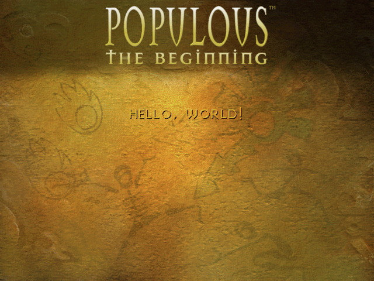

# POP3 - Graphics

JavaScript tools for reading and rendering [Populous: The Beginning](https://en.wikipedia.org/wiki/Populous:_The_Beginning) graphics files.

## Installation

```sh
npm install --save @pop3/graphics
```

## Usage

```js
const initGraphics = require('@pop3/graphics')

// Files should be a map that maps filenames to file content
const files = new Map(/* ... */)

// Create a graphics manager
const graphics = initGraphics(files)

// Load a palette
const palette = graphics.getPalette('data/fenew/fepal0.dat')

// Load a raw sprite file
const background = graphics.getRawSprite('data/fenew/febackg0.dat', 640, 480)

// Load a sprite file with multiple sprites
const logo = graphics.getSprites('data/fenew/felgspen.spr')

// Load a font
const largeTextFont = graphics.getFont('data/fenew/felo33we.spr', 'data/fenew/fepal0.dat')

// Draw a simple scene
const canvas = document.createElement('canvas')

canvas.width = 640
canvas.height = 480

const context = canvas.getContext('2d')

context.drawImage(background.render(palette), 0, 0)
context.drawImage(logo[0].render(palette), 180, 10)
context.drawImage(logo[1].render(palette), 460, 10)
context.drawImage(largeTextFont.renderText('Hello, World!'), 400, 140)
```

Produces:



## API

### `init(files: Map<string, ArrayBuffer | Uint8Array>): Manager`

Initialize a new Graphics Manager.

The files map should be a map that maps filenames into either an `ArrayBuffer` (browser) or `Buffer` (Node.js).

### `Manager`

*to be written*

### `Font`

*to be written*

### `Palette`

*to be written*

### `Sprite`

*to be written*
